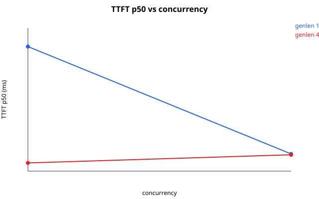
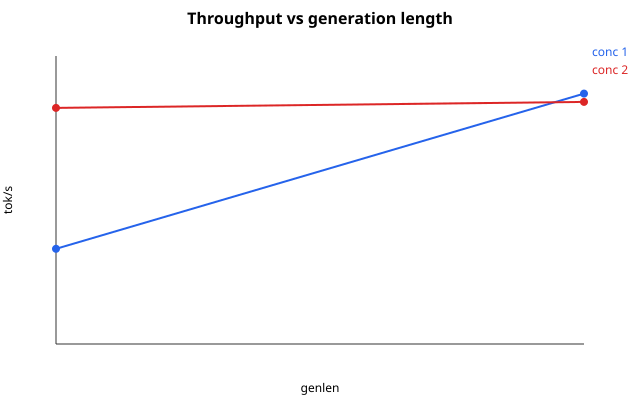
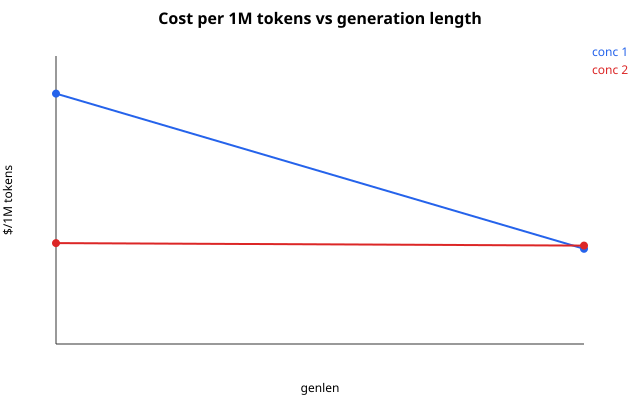
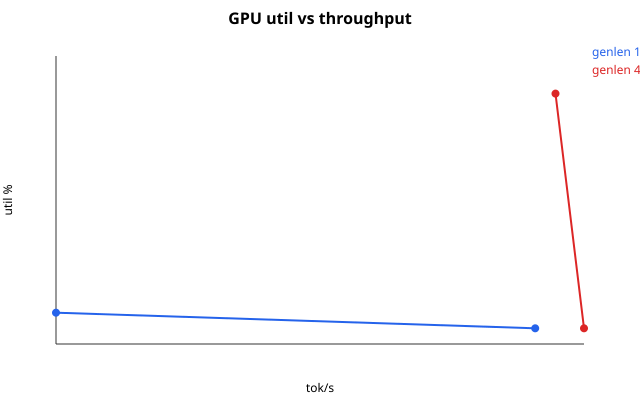

# voice-pipeline


**A full voice loop — speech in, speech out — running live on a single 4GB laptop GPU.**
No cloud, no API keys, no cluster: microphone (or wav) → text → reply → voice, in under a second.

```bash
curl -F f=@sample.wav http://localhost:8003/v1/voice | python -m json.tool
# {"text": "...", "reply": "Hello! How can I assist you today?",
#  "ttfa_s": 0.31, "total_s": 0.83, ...}
```

| Metric (measured, RTX 3050 4GB) | Value |
|---|---|
| Pipeline | Silero VAD → Whisper-base → Qwen2.5-0.5B → Kokoro-82M |
| Resident VRAM | ~1.9 GB (all four models live) |
| Voice-turn latency | TTFA **308 ms**, end-to-end **827 ms** |
| LLM decode | TTFT **14 ms**, **~69 tok/s** sustained |
| Speech recognition | RTF **0.020** (50x real-time) |
| Speech synthesis | RTF **0.045** (22x real-time) |
| Serving capacity | **9 sessions** @ 48 tokens, FIFO-queued |
| Cost | **$0.20 per million tokens** (local power, $0.05/hr) |
| Tests | 54 passing, 1 skipped |

## Contents

- [How it works](#how-it-works)
- [Capacity: how many sessions fit](#capacity-how-many-sessions-fit)
- [Performance](#performance)
- [Project structure](#project-structure)
- [Requirements](#requirements)
- [Installation](#installation)
- [Quickstart](#quickstart)
- [Use it in Python](#use-it-in-python)
- [REST + WebSocket API](#rest--websocket-api)
- [Configuration](#configuration)
- [Triton kernels](#triton-kernels)
- [Operations](#operations)
- [Testing](#testing)
- [Troubleshooting](#troubleshooting)
- [Roadmap](#roadmap)
- [Deep dives (docs/)](#deep-dives)

## How it works

```
mic / wav ──> VAD (Silero, ONNX CPU) ──> STT (Whisper-base)
    ──> LLM (Qwen2.5-0.5B, streaming tokens)
    ──> sentence splitter ──> TTS (Kokoro-82M) ──> wav out
```

One `VoiceEngine` holds all four models in a single process and VRAM pool.
LLM tokens stream out; each completed sentence is synthesized immediately,
so the first audio starts in ~300 ms without waiting for the full reply.

What makes this more than a demo glue script:

1. **VRAM-aware capacity planning.** At startup the server probes the GPU,
   prices one session from the generation length, and derives how many
   sessions it can serve — no hardcoded limits. See below.
2. **Fair session queues.** Burst traffic waits in a FIFO queue with a
   timeout instead of thundering-herd; only a truly full server says 503.
3. **Hand-written GPU kernels.** Custom Triton kernels (RMSNorm, RoPE,
   attention, SwiGLU, conv+SiLU…) with exact CPU fallbacks and parity tests.
   Every exported kernel runs in the hot path — nothing decorative.
4. **Honest benchmarking.** TTFT/TPO/throughput/GPU-util/power/cost are
   measured live and published with the methodology, including the parts
   that are deliberately left eager (documented, with numbers).

## Capacity: how many sessions fit

The question every serving system must answer: *given this GPU and this
workload, how many users fit?* The server answers it at every boot:

```
startup: probe VRAM (nvidia-smi)
       → warm models, measure baseline (weights resident)
       → price one session from generation length
       → max_sessions = (total − baseline − headroom) / per_session
       → resize session store + FIFO queue from the plan
```

Per-session price (`runtime/capacity.py`, unit-tested on CPU):

- **KV-cache share** — `2 × 24 layers × 2 kv-heads × 512 × 64 × 2B ≈ 6 MB`
- **History working set** — `20 turns × (200 prompt + 48 gen) tokens × 896 × 2B ≈ 8.5 MB`
- **Transient scratch** — TTS buffers + mel frontend ≈ 150 MB
- × **1.25 safety factor** → **≈ 206 MB/session** at 48 tokens

Worked example — this machine (RTX 3050 Laptop, 4096 MB):

| | genlen 48 | genlen 128 |
|---|---|---|
| Baseline (weights) | 1807 MB | 1807 MB |
| Headroom (10%) | 410 MB | 410 MB |
| Usable | 1879 MB | 1879 MB |
| Per session | 206 MB | 209 MB |
| **Sessions served** | **9** | **8** |

Longer generations cost more history per turn, so fewer sessions fit —
exactly the tradeoff the planner quantifies. The live plan is always
visible: `GET /health` → `capacity`, `GET /v1/sessions` → usage vs max.
Retune without code changes via `configs/pipeline.yaml` → `capacity:`.

## Performance

Measured 2026-09-12 on RTX 3050 Laptop 4GB (CUDA 12, torch 2.5.1),
`PYTHONPATH=. python benchmarks/bench_capacity.py`.
First-touch CUDA init inflates the very first row; steady state follows it.
GPU util is sampled via `nvidia-smi` at 2 Hz during each run — short
sub-second bursts under-fill the sampler, so treat util as a lower bound.

### LLM: latency vs concurrency vs generation length

| genlen | conc | TTFT p50 | TPO | TPS | req/s | tok/s | util% | W | tok/s/W | $/1M |
|---|---|---|---|---|---|---|---|---|---|---|
| 16 | 1 | 214ms¹ | 20.3ms | 26.4 | 2.40 | 26.4 | 2.0 | 19.8 | 1.33 | $0.5265 |
| 16 | 2 | 30ms | 29.4ms | 34.6 | 4.85 | 65.5 | 1.0 | 22.1 | 2.96 | $0.2122 |
| 48 | 1 | 14ms | 14.4ms | 69.6 | 6.31 | 69.4 | 1.0 | 22.1 | 3.14 | $0.2000 |
| 48 | 2 | 28ms | 25.8ms | 40.3 | 3.44 | 67.1 | 16.0 | 27.5 | 2.44 | $0.2070 |

¹ First generate after load includes CUDA init; steady-state TTFT is the 14–30 ms band.

Concurrency doubles token throughput (26 → 66 tok/s at genlen 16) while
per-request latency rises — the classic serving tradeoff, measured not
assumed. Peak efficiency: **3.14 tok/s per watt** (conc 1, genlen 48).




### Cost per million tokens

At a local amortized rate of **$0.05/hr** (laptop power + hardware share):

| workload | tok/s | $/1M tokens |
|---|---|---|
| genlen 48, conc 1 | 69.4 | **$0.2000** |
| genlen 48, conc 2 | 67.1 | $0.2070 |
| genlen 16, conc 2 | 65.5 | $0.2122 |




### Full voice turn (round-trip: synth speech → full pipeline)

| | TTFA | E2E | VRAM |
|---|---|---|---|
| Round-trip (synthetic speech in) | 308 ms | 827 ms | 1957 MB |
| Earlier live turn | 438 ms | 640 ms | 1941 MB |
| LibriSpeech samples (previous) | 531–858 ms | 1321–2590 ms | 1937 MB |

### Per-leg spot checks

| Leg | Latency | Real-time factor |
|---|---|---|
| VAD | ~50 ms | 0.01 |
| STT (Whisper) | 59 ms / 3 s audio | **0.020** |
| LLM TTFT / decode | 14 ms / ~69 tok/s | — |
| TTS (Kokoro, eager) | 141 ms | **0.045** |

Raw runs: `benchmarks/results/capacity_<ts>.json`, tables in
`benchmarks/results/capacity.md`. Reproduce everything with
`PYTHONPATH=. python scripts/benchmark.py capacity`.

## Project structure

```
voice-pipeline/
├── serve.py            # API entrypoint: python serve.py  (port 8003)
├── requirements.txt    # pinned runtime deps, pip install only
├── configs/            # pipeline.yaml (+capacity) + per-leg yamls
├── engine/             # VoiceEngine, session store, streaming, audio utils
├── models/
│   ├── qwen.py         # LLM leg: QwenEngine (weights + KV-cache + attn)
│   ├── whisper.py      # STT leg: WhisperEngine (mel + encoder + decoder)
│   ├── tts.py          # TTS leg: KokoroEngine (voices + text + synth)
│   └── silero_vad/     # VAD leg (ONNX CPU + energy fallback)
├── triton_kernels/     # low-level kernels (rmsnorm, rope, attn, conv1d, ...)
│                       # + per-leg surface: qwen.py / whisper.py / tts.py
├── runtime/            # device / memory / profiler / tensor helpers +
│                       # capacity planner, FIFO scheduler, batcher, budget
├── server/             # FastAPI app: routes, schemas, websocket, middleware
├── scripts/
│   ├── download_models.py
│   ├── validate_models.py
│   ├── benchmark.py    # dispatcher (incl. capacity)
│   └── convert_weights.py
├── benchmarks/         # per-leg + pipeline + capacity sweeps + results/
│   ├── bench_capacity.py
│   └── results/        # capacity.json/md + SVG graphs
├── tests/              # 54-test unittest suite (engine/kernels/models/…)
├── examples/
│   ├── offline.py      # wav in -> reply wav
│   └── streaming.py    # chunked-file simulated streaming turn
└── README.md
```

## Requirements

- Python 3.12
- CUDA GPU (measured on RTX 3050 4 GB, CUDA 12; CPU works, slower)
- ~2.5 GB free VRAM for warm run, ~5 GB disk for weights
- System: `ffmpeg`, libsndfile (for `soundfile`), `nvidia-smi` (telemetry; torch fallback)
- Python deps: `torch` CUDA build, `triton`, `transformers`, `fastapi`,
  `uvicorn`, `soundfile`, `numpy`, `onnxruntime`, `pyyaml`, `kokoro`

Get the CUDA torch first if pip resolves CPU-only:

See https://pytorch.org/get-started/locally/ for your platform, then
install the rest from `requirements.txt`.

## Installation

Run everything from inside `voice-pipeline/`:

```bash
cd VoiceAgent/voice-pipeline
pip install -r requirements.txt
```

`PYTHONPATH=.` must be set on every command below so the
`triton_kernels` / `models` / `engine` / `server` packages resolve.

Download and verify weights:

```bash
PYTHONPATH=. python scripts/download_models.py
PYTHONPATH=. python scripts/validate_models.py
```

Start the API (warms all legs, probes VRAM, plans capacity — ~2 min first boot):

```bash
PYTHONPATH=. python serve.py
# optional: PYTHONPATH=. python serve.py --host 0.0.0.0 --port 8003
```

Watch the startup lines: `voice engine ready vram=…` then
`capacity: 9 sessions @ genlen 48, 4 inflight (…)`.

## Quickstart

1. Install + download models (see above).
2. Start server: `PYTHONPATH=. python serve.py`
3. Full voice turn:

```bash
curl -F f=@sample.wav http://localhost:8003/v1/voice | python -m json.tool
```

4. Health (with capacity plan) + metrics (with queue stats):

```bash
curl http://localhost:8003/health
curl http://localhost:8003/metrics
```

5. Run tests + benchmarks:

```bash
PYTHONPATH=. python -m unittest discover -s tests -t . -q
PYTHONPATH=. python scripts/benchmark.py capacity
```

## Use it in Python

Offline file-to-file turn:

```bash
PYTHONPATH=. python examples/offline.py input.wav reply.wav
```

Simulated streaming turn (feeds `--chunk-ms` slices through VAD first):

```bash
PYTHONPATH=. python examples/streaming.py input.wav reply_stream.wav --chunk-ms 320
```

Direct engine API:

```python
from engine.engine import VoiceEngine

eng = VoiceEngine()  # loads configs/*, warms legs, reads VRAM budget

segs = eng.vad_segments(audio, sr=16000)
stt = eng.transcribe(audio, sr=16000)          # {"text", "rtf", "ttfs", ...}
chat = eng.chat("Hello!", max_tokens=48)       # {"text", "ttft", "tps", ...}
tts = eng.speak(chat["text"])                  # {"wav", "sr", "synth_s"}

turn = eng.stream_turn(audio, sr=16000)        # full VAD->STT->LLM->TTS
print(turn["text"], turn["reply"])
print(f"TTFA={turn['ttfa_s']*1000:.0f}ms total={turn['total_s']*1000:.0f}ms")
```

Multi-turn with sessions:

```python
sid = "my-session-id"
r1 = eng.chat("My name is Ada.", session_id=sid)
r2 = eng.chat("What is my name?", session_id=sid)  # remembers r1
```

Capacity math in code (same functions the server uses):

```python
from runtime.capacity import probe_vram, plan_capacity
info = probe_vram()                            # nvidia-smi -> torch -> zeros
plan = plan_capacity(info["total_mb"], 1807, max_new_tokens=48)
print(plan["max_sessions"], "sessions @", plan["generation_length"], "tokens")
```

## REST + WebSocket API

Base URL default: `http://localhost:8003`

| Method | Endpoint | Input | Output |
|---|---|---|---|
| `GET` | `/health` | — | `{ok, uptime_s, engine_loaded, missing, vram_mb, triton, capacity}` |
| `GET` | `/metrics` | — | per-endpoint `{count, errors, mean_s}`, inflight, queue stats, vram |
| `POST` | `/v1/vad` | wav upload `f` | `{segments, audio_dur_s, n_segments}` |
| `POST` | `/v1/transcribe` | wav upload `f` | `{text, rtf, ttfs, dur}` |
| `POST` | `/v1/chat` | `{prompt, max_tokens, stream, session_id, reset}` | JSON or SSE tokens + `[DONE]` |
| `POST` | `/v1/speak` | `{text}` | `audio/wav` bytes |
| `POST` | `/v1/voice` | wav upload `f` + optional `session_id` form field | `{text, reply, wav_b64, ttfa_s, total_s, vram_mb, session_id}` |
| `GET` | `/v1/sessions` | — | `{sessions, turns, max_sessions, generation_length}` |
| `DELETE` | `/v1/session/{id}` | — | `{ok, cleared, session_id}` |
| `POST` | `/v1/talk` | wav upload `f` + optional `session_id` | staged SSE: `stt→llm→tts→turn` + `[DONE]` (curl-able) |
| `WS` | `/v1/talk?session_id=` | PCM16 chunks / commit | live `vad` + partial `stt`, staged `llm→tts→turn` |

Examples:

```bash
# Transcribe
curl -F f=@sample.wav http://localhost:8003/v1/transcribe

# Chat (JSON)
curl -X POST http://localhost:8003/v1/chat \
  -H 'Content-Type: application/json' \
  -d '{"prompt":"Say hi in one short sentence.","max_tokens":48}'

# Chat (SSE stream)
curl -N -X POST http://localhost:8003/v1/chat \
  -H 'Content-Type: application/json' \
  -d '{"prompt":"Count to three.","stream":true}'

# TTS
curl -X POST http://localhost:8003/v1/speak \
  -H 'Content-Type: application/json' \
  -d '{"text":"Hello from the voice pipeline."}' --output out.wav

# Full turn with session memory
curl -F f=@sample.wav -F session_id=my-uuid http://localhost:8003/v1/voice

# Same turn, staged over plain HTTP (no WebSocket client needed)
curl -N -F f=@sample.wav http://localhost:8003/v1/talk
# event: stt ... event: llm ... event: tts ... event: turn ... [DONE]
```

Live streaming over one socket (PCM16 chunks in, staged events out —
STT text the moment it completes, then LLM tokens, then TTS audio):

```python
import asyncio, json, struct
import websockets  # pip install websockets

async def main():
    async with websockets.connect(
            "ws://localhost:8003/v1/talk?session_id=my-uuid") as ws:
        print(await ws.recv())  # {"event": "ready", ...}
        with open("sample.wav", "rb") as f:
            pcm = f.read()      # mono 16k PCM16 frames in practice
        await ws.send(pcm[:32000])
        await ws.send(json.dumps({"type": "commit"}))
        async for msg in ws:
            evt = json.loads(msg)
            print(evt["event"], evt.get("text", evt.get("token", ""))[:60])
            if evt.get("event") == "turn":
                break

asyncio.run(main())
```

Sessions: frontend creates one UUID (`crypto.randomUUID()`), sends it as
`session_id` on `/v1/chat`, `/v1/voice` (form field), or `?session_id=` on
WS `/v1/talk`. Omit it for stateless. `reset:true` (chat) or
`DELETE /v1/session/{id}` clears. History bounded per session, 30-min TTL,
session count capped by the VRAM-derived plan (9 on the reference 4GB
card), RAM-only.

## Configuration

`configs/pipeline.yaml`:

```yaml
sample_rate: 16000
device: cuda
server:
  host: 0.0.0.0
  port: 8003
legs:
  vad: configs/vad.yaml
  stt: configs/whisper.yaml
  llm: configs/qwen.yaml
  tts: configs/tts.yaml
streaming:
  max_tokens: 48          # <-- generation length drives session pricing
  sentence_split: "[.!?]+"
vram_budget_mb: 3800      # hard guard, enforced per voice turn (503 past it)
capacity:
  per_turn_mb: 150        # transient scratch per turn
  headroom_frac: 0.10     # VRAM fraction held back
  headroom_min_mb: 400
  safety_factor: 1.25     # per-session price multiplier
  sessions_cap: 1000      # ceiling even when VRAM allows more
  max_inflight: 4         # measured serialization point
  queue_timeout_s: 10     # FIFO wait before 503 + Retry-After
```

Edit `configs/qwen.yaml` (`max_new_tokens`), `configs/tts.yaml` (`voice`),
`configs/vad.yaml` (`threshold`) to tune quality / latency / memory.
Raising `max_new_tokens` automatically lowers served sessions at next boot.

## Triton kernels

All kernels are parity-tested and wired in (`HAVE_*=True` verified).
One import per leg — `triton_kernels/qwen.py`, `triton_kernels/whisper.py`,
`triton_kernels/tts.py` — each with Triton fast path + exact torch fallback.

| Kernel | Speedup vs eager | Status |
|---|---|---|
| rope_batched (prefill) | 26.7x | TTFT 173 → 14 ms |
| conv1d_silu / in1d_silu (TTS post) | 2.53x | in TTS hot path |
| lstm_cell (VAD) | 1.59x | standalone; ONNX wiring pending |
| rmsnorm / rope / swiglu / gqa / layernorm / row_softmax / decode-attn / batched-decode | active in hot paths | profile-verified |
| fused_qkv (STT) / fused_qkv_gqa (LLM) | faster in-engine than microbench | primary + fallback |
| plain conv1d | 0.00x vs cuDNN | stays on cuDNN, documented |

Full table: `benchmarks/results/kernel_profile.txt`.

Honest call: Kokoro full-model `torch.compile` is broken in this env
(dynamo × transformers-5 → `NameError: torch`); submodule static compile
crashes on new lengths; dynamic compile is slower than eager for varying
sentences (RTF 0.37 vs 0.045). Eager TTS + Triton post-processing is the
right default, and the CUDA-graph runner in `runtime/` stays explicitly
opted out for the same measured reason.

By leg:

| Leg | File | Custom Triton | Note |
|---|---|---|---|
| STT | `models/whisper.py` | layernorm, row_softmax, decode-attn, batched-decode, fused_qkv | every export in hot path |
| LLM | `models/qwen.py` | rmsnorm, rope (+batched), swiglu, gqa, fused_qkv_gqa | exact text match vs HF |
| TTS | `models/tts.py` | conv1d+silu, in1d+silu (post-filter), resample | Kokoro eager + Triton audio path |
| VAD | `models/silero_vad/` | — (ONNX CPU, RTF 0.01) | nothing to win |

## Operations

- `GET /health` is liveness-safe (never constructs the engine) and now
  publishes the `capacity` plan: total/baseline/headroom/usable VRAM,
  per-session price + breakdown, `max_sessions`, `max_inflight`.
- `GET /metrics` adds FIFO stats (`pending`, `running`, `admitted_total`)
  and mean `queue_wait_s` alongside per-endpoint counts/errors/latency.
- Admission: turns take a FIFO ticket (`queue_timeout_s`, default 10 s);
  a full queue returns 503 + `Retry-After: 2` instead of queueing
  unboundedly. Per-turn VRAM guard (`vram_budget_mb`, default 3800 MB)
  is enforced in `VoiceEngine.stream_turn` → 503 past it.
- Generation stops at `<|im_end|>` / `<|endoftext|>` — SSE ends cleanly
  with `[DONE]`, no template leakage into the stream.
- Guards: audio capped at 60 s (413), empty audio (400), unreadable
  upload (400), prompt/tokens/text bounds via schemas (422), missing
  legs (503).
- Concurrency: single worker serializes past 4 in-flight (measured) —
  the queue sheds load instead of melting latency. True admission
  batching is the next rung, not this rung.
- VRAM: ~1.9 GB steady with all four legs; 9 sessions fit the reference
  4 GB card at 48 tokens.
- WS `/v1/talk` shares the HTTP engine singleton — a second VoiceEngine
  would OOM the 4 GB card. Verified with a real socket turn.
- VAD stays ONNX-on-CPU by decision: 2.3 MB vendored weights, RTF 0.01,
  nothing to win. The Triton LSTM cell is implemented + parity-tested
  (`HAVE_TRITON_LSTM=true`) for the day the VAD outgrows ONNX.

## Testing

```bash
PYTHONPATH=. python -m unittest discover -s tests -t . -q
# 54 tests OK (engine turns, kernel parity, model legs, capacity math,
# runtime helpers, live server error paths 400/413/422/503)
```

Validate weights + imports after download:

```bash
PYTHONPATH=. python scripts/validate_models.py
PYTHONPATH=. python scripts/benchmark.py capacity   # regenerates numbers+graphs
```

## Deep dives

- [`docs/architecture.md`](docs/architecture.md) — complete system
  architecture: component map, startup sequence, every request flow,
  latency/VRAM budgets, failure-mode table
- [`docs/capacity.md`](docs/capacity.md) — the VRAM capacity model,
  queueing design, worked 4GB example, retuning guide
- [`docs/benchmarks.md`](docs/benchmarks.md) — profiling methodology,
  result schema, reproducing every number above

## Troubleshooting

| Symptom | Fix |
|---|---|
| `ModuleNotFoundError: triton_kernels / models / engine / server` | Run from `voice-pipeline/` with `PYTHONPATH=.` |
| pip installed CPU-only torch | Install CUDA build from pytorch.org first, then `pip install -r requirements.txt` |
| `leg(s) not loaded (503)` | Run `scripts/download_models.py` + `validate_models.py`, check `GET /health` → `missing` |
| `server saturated (503)` | Queue timed out under burst; retry after `Retry-After`, or raise `queue_timeout_s` / lower `max_tokens` |
| `needs ~XMB but budget is 3800MB (503)` | Per-turn guard tripped; free VRAM or raise `vram_budget_mb` |
| First boot slow (~2 min) | Normal: all four legs warm up; later boots are faster |
| OOM on 4 GB card | Close other GPU apps; only one `VoiceEngine` may exist (HTTP + WS share it) |
| Empty / long audio errors | Cap is 60 s wav; empty uploads return 400 by design |
| No GPU util in benchmark | `nvidia-smi` missing → telemetry falls back to torch VRAM only |

## Roadmap

- [x] VRAM-derived session capacity (this release)
- [x] FIFO admission queue with timeout (this release)
- [x] TTFT/TPO/throughput/util/power/cost profiling (this release)
- [ ] True admission batching (beyond FIFO load-shedding)
- [ ] Partial STT + VAD-driven barge-in over WS
- [ ] ONNX → Triton VAD cutover when it outgrows CPU
- [ ] Quantized LLM / STT options for <2 GB cards
- [ ] Frontend demo client for `/v1/talk`
