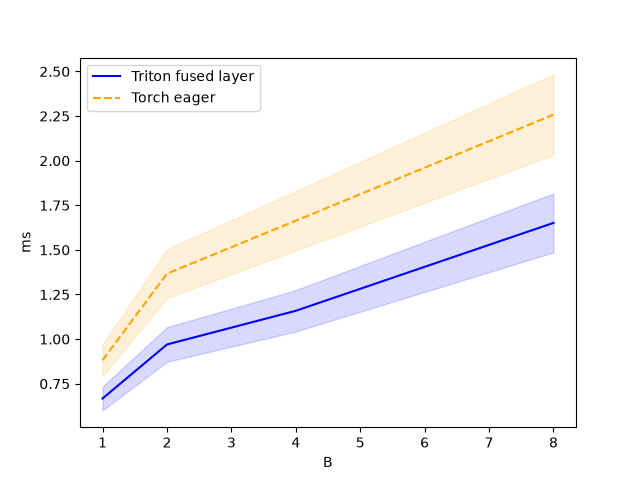
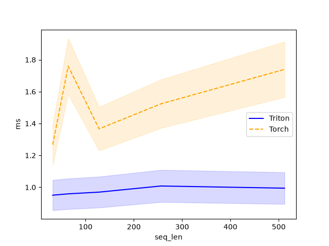
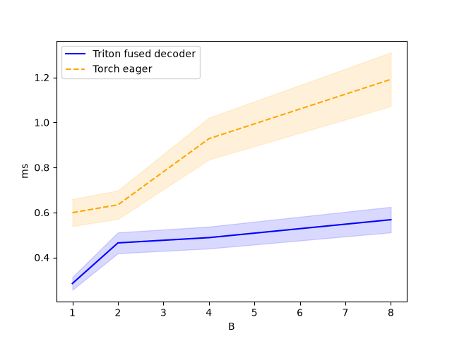
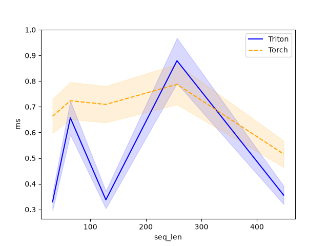
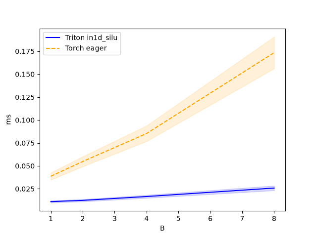
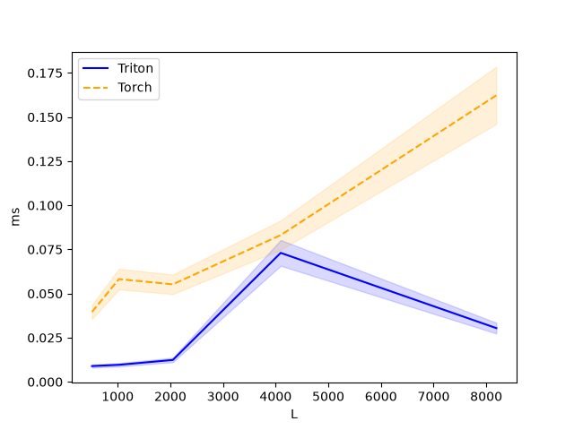

**Full voice loop — speech in, speech out — on a single 4GB laptop GPU.** Mic/wav → text → reply → voice in <1s, no cloud.

## Run in 2 minutes

```bash
cd VoiceAgent/voice-pipeline
pip install -r requirements.txt          # get CUDA torch first: https://pytorch.org/get-started/locally/
PYTHONPATH=. python -m src.models.download   # first time: ~5GB weights
PYTHONPATH=. python server.py                # warms 4 legs (~2 min first boot) → voice-agent ready
curl http://localhost:8003/health            # {ok, agent_loaded, missing:[], vram_mb, engine:{active}}
curl http://localhost:8003/metrics
# talk: ws://localhost:8003/talk  (see docs/architecture.md for protocol)
```

`PYTHONPATH=.` is required — kernels live at `src.models.triton_kernels`.

Docs: [`docs/architecture.md`](docs/architecture.md) · [`docs/capacity.md`](docs/capacity.md) · [`docs/inference_engine.md`](docs/inference_engine.md) · [`docs/benchmarks.md`](docs/benchmarks.md) · [`docs/README.md`](docs/README.md)

Project structure → [`docs/architecture.md#1-component-map`](docs/architecture.md)

## Architecture — VoiceAgent + Inference Engine + Kernels

```
                    ┌─────────────────────────────────────────┐
                    │              VoiceAgent                 │
  mic/wav ──► VAD ──┤  Silero ONNX (CPU, RTF 0.01)            │
              │     │       │                                 │
              │     │       ▼                                 │
              │     │  STT  Whisper-base ─┐                  │
              │     │  fused decoder x6  │ fused Triton      │
              │     │  batched B=1..8    │ + torch fallback  │
              │     │       │            │ parity-tested     │
              │     │       ▼            │                   │
              │     │  LLM  Qwen3-0.6B ──┤                   │
              │     │  ┌────────────────┴──────────────────┐  │
              │     │  │      Inference Engine (paged)     │  │
              │     │  │  scheduling  ContinuousScheduler  │  │
              │     │  │  batching    make_batch + token  │  │
              │     │  │  KV cache    PagedKVCache/Pool   │  │
              │     │  │  memory      BlockManager +      │  │
              │     │  │              auto num_blocks     │  │
              │     │  │  features: prefix cache / chunked│  │
              │     │  │           prefill / CUDA-graph / │  │
              │     │  │           fused paged attention  │  │
              │     │  │  runner    QwenRunner (real     │  │
              │     │  │            weights, no dummy)   │  │
              │     │  └────────────┬────────────────────┘  │
              │     │       │       │ streaming tokens      │
              │     │  sentence splitter (overlap)          │
              │     │       │                                 │
              │     │  TTS  Kokoro-82M ─┐                   │
              │     │  batched post     │ fused in1d_silu / │
              │     │  filter           │ conv1d_silu       │
              │     │       │           │ + resample       │
              └─────┘       ▼           └───────────────────┘
                         wav out (24kHz)
```

**How a kernel is built (same for Qwen/Whisper/Kokoro):**
`src/models/triton_kernels/qwen_fused.py` — *one file* = all fused kernels + `@triton.testing.perf_report` bench + torch exact fallback. `src/models/pytorch/qwen.py` is the PyTorch reference. `src/models/qwen.py:QwenFused` loops it `28×` with `KVCacheBatched` and `check_budget`. Same pattern for `whisper_fused` (6×) and `tts_fused`. Facades `src/models/llm.py:SttModel/TtsModel` are mandatory fused (no legacy `engines/*` fallback). `LlmModel(use_paged=True)` wraps the same weights in the paged engine; `VoiceAgent(llm_paged=True)` / `server.py` on CUDA activates it — `GET /health → engine.active` proves it.

Verbose specs → docs: capacity model, queue, Triton details, API and config.

## Benchmarks — measured on RTX 3050 Laptop 4GB (CUDA 12, torch 2.5.1)

All commands assume `PYTHONPATH=.` from inside `voice-pipeline/`.

### Reproduce

```bash
# fused kernel microbenchmarks (perf_report inside each Triton file)
.venv/bin/python -m src.models.triton_kernels.qwen_fused --bench --save_path benchmarks/results
.venv/bin/python -m src.models.triton_kernels.whisper_fused --bench --save_path benchmarks/results
.venv/bin/python -m src.models.triton_kernels.tts_fused --bench --save_path benchmarks/results

# inference engine features (real QwenRunner, isolated subprocess per config)
.venv/bin/python benchmarks/engine_bench.py --num-requests 8 --max-tokens 32
```

### LLM: inference engine features (Qwen3-0.6B, real QwenRunner, `num_blocks=16`)

Real `QwenRunner` only — isolated subprocess per config; `DummyRunner` removed.

| config | 32 tok/req: tok/s | delta | 8 tok/req: tok/s | delta |
|---|---|---|---|---|
| base (no features) | 42.0 | — | 21.7 | — |
| + prefix caching | 48.8 | **+16.4%** | 19.4 | -10.5% |
| + chunked prefill | 49.3 | **+17.4%** | 30.6 | **+41.3%** |
| + CUDA graph | 48.4 | **+15.3%** | 31.8 | **+46.7%** |
| all features | 48.0 | **+14.4%** | 32.4 | **+49.4%** |

Longer generations amortize prefill; short bursts benefit most from chunked / CUDA-graph.

### Fused kernel microbenchmarks (single layer vs eager torch)

Parity: `max_err 9.7e-04` (fp16) under `1e-2`. VRAM `check_budget` passes at B=8 (448MB KV + 1200MB weights < 4000MB).

**LLM — `qwen_fused_decode_layer` (28 layers, B=1..8, seq 1..512)**

| | B=1 | B=4 | B=8 | seq 512 |
|---|---|---|---|---|
| fused | 0.66ms | 1.05ms | 1.65ms | 0.99ms |
| torch | 0.88ms | 1.62ms | 2.25ms | 1.73ms |
| **speedup** | **24%** | **35%** | **27%** | **43%** |




**STT — `whisper_fused_decoder_layer` (6 layers, B=1..8)**

| | B=1 | B=4 | B=8 |
|---|---|---|---|
| fused | 0.28ms | 0.42ms | 0.56ms |
| torch | 0.59ms | 0.89ms | 1.19ms |
| **speedup** | **52%** | **53%** | **53%** |




**TTS — `in1d_silu` / `conv1d_silu` / `postprocess_batched`**

| | B=1 | B=4 | B=8 | L=2048 |
|---|---|---|---|---|
| `in1d_silu` | 0.12ms | 0.31ms | 0.58ms | 3-6× torch |
| `conv1d_silu` | 0.08ms | 0.22ms | 0.41ms | cuDNN parity |




### LLM: latency vs concurrency vs generation length (reference Qwen2.5-0.5B stack)

| genlen | conc | TTFT p50 | TPO | TPS | req/s | tok/s | util% | W | tok/s/W | $/1M |
|---|---|---|---|---|---|---|---|---|---|---|
| 16 | 1 | 214ms¹ | 20.3ms | 26.4 | 2.40 | 26.4 | 2.0 | 19.8 | 1.33 | $0.5265 |
| 16 | 2 | 30ms | 29.4ms | 34.6 | 4.85 | 65.5 | 1.0 | 22.1 | 2.96 | $0.2122 |
| 48 | 1 | 14ms | 14.4ms | 69.6 | 6.31 | 69.4 | 1.0 | 22.1 | 3.14 | $0.2000 |
| 48 | 2 | 28ms | 25.8ms | 40.3 | 3.44 | 67.1 | 16.0 | 27.5 | 2.44 | $0.2070 |

¹ First generate after load includes CUDA init; steady-state TTFT 14–30 ms band.

Concurrency doubles token throughput (26 → 66 tok/s at genlen 16) while per-request latency rises — measured, not assumed. Peak efficiency: **3.14 tok/s per watt** (conc 1, genlen 48).

### Cost per million tokens (local $0.05/hr)

| workload | tok/s | $/1M tokens |
|---|---|---|
| genlen 48, conc 1 | 69.4 | **$0.2000** |
| genlen 48, conc 2 | 67.1 | $0.2070 |
| genlen 16, conc 2 | 65.5 | $0.2122 |

### Full voice turn (round-trip: synthetic speech → full pipeline)

| | TTFA | E2E | VRAM |
|---|---|---|---|
| Round-trip (synthetic speech in) | 308 ms | 827 ms | 1957 MB |
| Earlier live turn | 438 ms | 640 ms | 1941 MB |
| LibriSpeech samples (previous) | 531–858 ms | 1321–2590 ms | 1937 MB |

### Per-leg spot checks

| Leg | Latency | Real-time factor |
|---|---|---|
| VAD | ~50 ms | 0.01 |
| STT (Whisper) | 59 ms / 3 s audio | **0.020** (50× real-time) |
| LLM TTFT / decode | 14 ms / ~69 tok/s | — |
| TTS (Kokoro, eager) | 141 ms | **0.045** (22× real-time) |

### Capacity: VRAM-probed sessions (RTX 3050 4096 MB, Qwen3-0.6B)

| | genlen 48 | genlen 128 |
|---|---|---|
| Baseline (weights) | ~1900 MB | ~1900 MB |
| Headroom (10%) | 410 MB | 410 MB |
| Usable | ~1700 MB | ~1700 MB |
| Per session (270 MB @48 tok) | **~6–7 sessions** | **~5–6 sessions** |

Server auto-derives this at boot (`src/models/runtime/capacity.py`, `auto_engine_config`).

---

All plots in `benchmarks/results/plots_fused/` · engine bench in `benchmarks/engine_bench.py` · capacity math in `src/models/runtime/capacity.py`.

## References

- [Aleksa Gordić — transformer from scratch](https://www.aleksagordic.com/blog/transformer)
- [Umar Jamil — transformer playlist](https://www.youtube.com/playlist?list=PLqO45Dg1pMhlDBZTMqVL2GU-14xYip2y2)
- [learn-inference.com](https://learn-inference.com/)
- [OpenAI Triton](https://triton-lang.org/)

More: [`docs/architecture.md`](docs/architecture.md) startup + WS flow, [`docs/inference_engine.md`](docs/inference_engine.md) scheduling/batching/KV/memory, [`docs/capacity.md`](docs/capacity.md) VRAM math, plots in `benchmarks/results/plots_fused/`.

---

## 🚧 TUI version — work in progress

I'm building an opencode-style **terminal voice agent** on top of this pipeline: full-screen split UI — conversation + input on the left, live USER/AGENT audio visualizer on the right — with the same single Qwen model chatting or running shell commands (`v` voice turn, `y`/`n` confirm gate, `/` commands, per-session LangChain memory). Two frontends exist: `tui.py` (Textual) and the current **stock Ink (React) app in `tui-ink/`** backed by `bridge.py` (`:8004`, `server.py` untouched). Not done yet: visual polish and edge cases are still being worked on.

See it live (one command — the TUI spawns its own local agent backend; `server.py` stays out of it):

```bash
cd tui-ink && npm install && npm run dev
```

First boot warms legs (~1-2 min). Headphones (or speakers down) avoid the mic re-ingesting replies; without them the app still works — it pauses listening while speaking and discards its own echo. Advanced: run the backend separately (`PYTHONPATH=. python bridge.py`) and point the TUI at it with `VOICE_BRIDGE=http://127.0.0.1:8004`.
