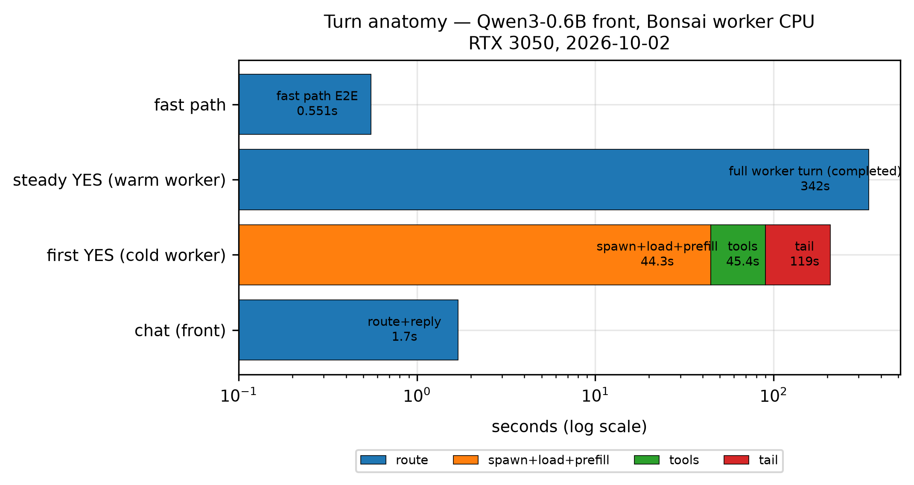
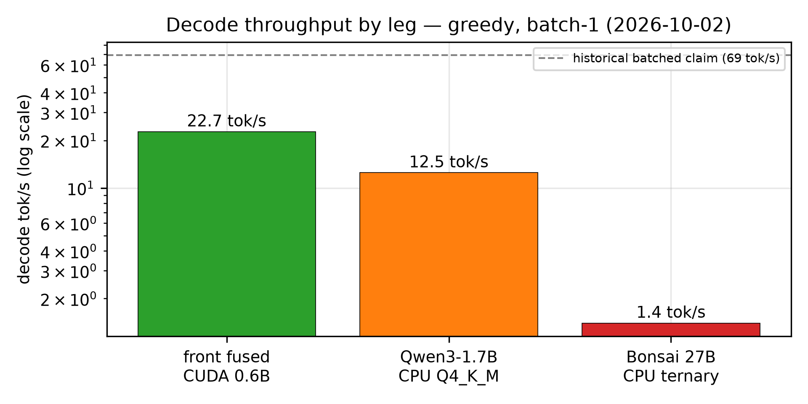
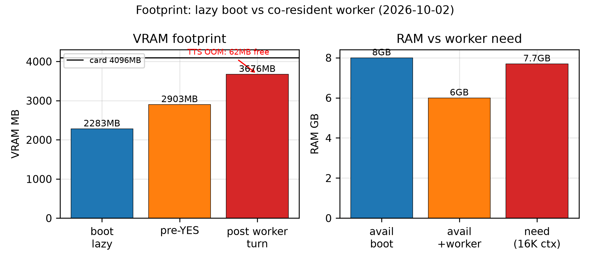
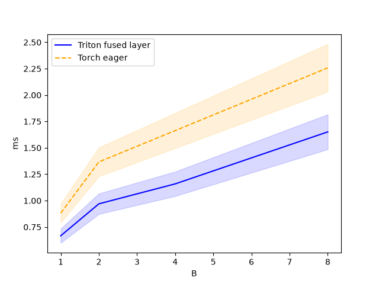
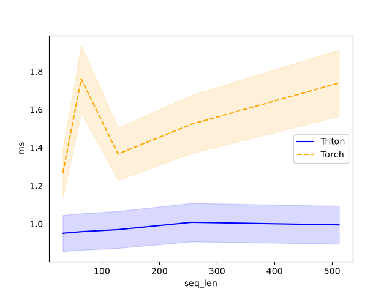
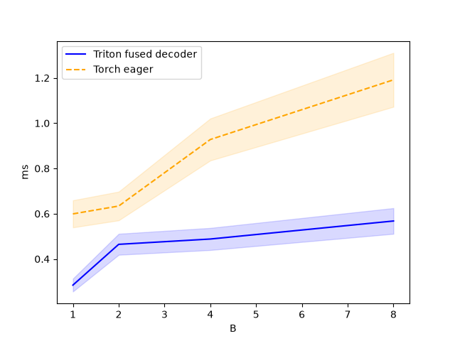
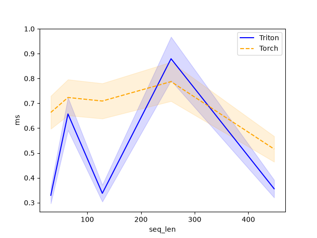
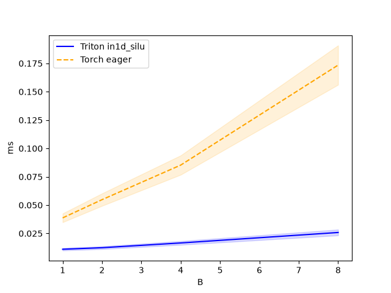
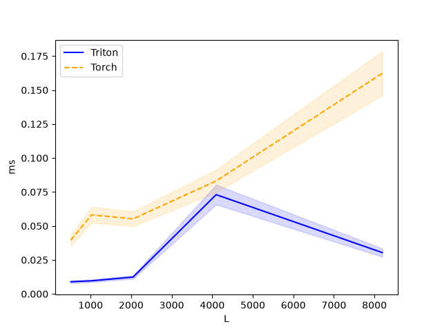

---

```
─── 01 ~ 1 / HIGH LEVEL ──────────────────────────────────────────────────────────────────────

  ┌────────┐   ┌─────────┐   ┌────────────────────┐   ┌─────────┐
  │  VAD   │──▶│   STT   │──▶│    VoiceAgent      │──▶│   TTS   │──▶ wav
  │ Silero │   │ Whisper │   │ front 0.6B / 27B   │   │ Kokoro  │
  │ ONNX   │   │  base   │   │ tools · memory     │   │  82M    │
  └────────┘   └─────────┘   └────────────────────┘   └─────────┘
   RTF≈0.01     RTF≈0.06        ≤6 steps/turn

─── 01 ~ 2 / TWO BRAINS ──────────────────────────────────────────────────────────────────────

  text ──▶ front Qwen3-0.6B  ── one yes/no, NO tools, 6 tokens
            │
            ├── NO ──▶ front writes reply ──▶ TTS     (≈0.3s, 27B never loads)
            │
            └── YES ─▶ worker Bonsai 27B ──▶ full harness ──▶ TTS

  unparseable answer ──▶ YES        failure is asymmetric: silence is never "done"
  backstop regex ──▶ force YES      0.6B narration is the bug to never ship

─── 01 ~ 3 / CONTEXT BUDGET ──────────────────────────────────────────────────────────────────

  BUDGET 16K - pack_prompt cuts obs → hist, never system/facts
  ┌────────────┬───────────┬──────────────────────┬───────────────┬────────────┐
  │ system +   │ tool      │ history              │ observations  │ reserve    │
  │ preamble   │ specs     │ elastic - newest-    │ 1500 → 500    │ 256 / 512  │
  │ ~2.5K      │ ~1K       │ first fill           │ → drop        │ floor      │
  │ FIXED      │ FIXED     │ ELASTIC              │ ELASTIC       │ FIXED      │
  └────────────┴───────────┴──────────────────────┴───────────────┴────────────┘
  count: /tokenize exact, else chars/3.5 - per-backend rows in budget.py:BUDGETS

─── 02 / TOOLS ───────────────────────────────────────────────────────────────────────────────

  12 ops (src/tools/terminal.py:ALLOWED_OPS)
  exec  exec_bg  poll  read  write  edit  grep  list  python_exec  fetch  searxng  done

  model text ──▶ 5 parsers, tried in order ──▶ action ──▶ 2 gates ──▶ run
                gemma → functiongemma         ┌──────────────┐
                → toolcall-dict → terminal    │ DENY  fork   │
                → xml                         │ bomb rm -rf /│
                                             ├──────────────┤
                edit = ANCHORED replace      │ CONFIRM sudo │
                fails if anchor missing      │ rm docker ssh│
                                             └──────────────┘
  router: bge-small-en-v1.5 embeds the request, top-k=3 ops + deps, ContextVar → prompt
  MCP: python_exec / fetch / web_search over stdio, merged into the same op set

─── 03 / MEMORY ──────────────────────────────────────────────────────────────────────────────

  L1 evict -> L2 store - L2/L3 recall -> prompt (every turn)
  ┌────────────────────┐
  │ L1 WORKING         │
  │ sessions/*.json    │
  │ window+tok-TTL-LRU │
  └─────────┬──────────┘
             │ evict → summarize_turns → store()
             ▼
  ┌────────────────────┐                 ┌──────────────────────┐
  │ L2 EPISODIC bge    │ ──────────────▶ │ ASSEMBLED PROMPT     │
  └────────────────────┘ [Past episodes] │ facts → episodes →   │
  ┌────────────────────┐                 │ hist newest-first    │
  │ L3 FACTS s-P-o     │ ──────────────▶ │ + CWD trailer        │
  └────────────────────┘ [User facts]    └──────────────────────┘
  L2 = memory/episodic.db (bge-small cos+kw+rec) - L3 = memory/facts.md (newer wins)

  TURNS - middleware in order, then pack
  ┌──────────┐    ┌────────────┐    ┌────────────┐    ┌─────────────┐
  │ write_   │───▶│ TrimObs    │───▶│ InjectTool │───▶│ Summarizer  │──▶ pack_prompt
  │ todos    │    │ head 1500  │    │ sem top-k  │    │ trg .9xctx  │
  │ (plan)   │    │ + omitted  │    │ ~1K specs  │    │ keep 6      │
  └──────────┘    └────────────┘    └────────────┘    └─────────────┘

  COMPACTION - cross-turn
  ┌───────────────┐                     ┌────────────────┐
  │ model-switch  │ ──────────────────▶ │ compacted sess │
  │ (bridge)      │  <=150w + last 2    │ summary + 2    │
  └───────────────┘  per-target skip    └────────────────┘

  SIM-AGENT - depth 1, never nested, max 6
  ┌──────────────┐    ┌────────────────┐    ┌──────────────────┐    ┌───────────┐
  │ plan         │───▶│ stash frame    │───▶│ lean subtask x N │───▶│ envelope  │
  │ 1 cheap call │    │ sim_<sid>.json │    │ sliver+preamble  │    │ > parent  │
  │ numbered     │    │                │    │ scratch session  │    │ + restore │
  └──────────────┘    └────────────────┘    └──────────────────┘    └───────────┘

─── 04 / SESSIONS ────────────────────────────────────────────────────────────────────────────

  id = ses_ + 26 base62        body ^[0-9A-Za-z]{6,64}$      "voicert -s <id>"
  │
  ├── per-session LOCK ──▶ contenders queue, never interleave  (term/queued)
  ├── window  20 turns / 30 min / 1000 sessions / optional token cap
  └── title   2 words, 12 tokens, front brain, printed on the exit card

  VoiceAgent holds windows in RAM only. Persisting is the APP's job:
      import_session(sid, data)   on start      never raises
      export_session(sid)          after a turn  never raises

─── 05 / MODELS ──────────────────────────────────────────────────────────────────────────────

  leg  backend     port   notes
  ───  ──────────  ─────  ─────────────────────────────────────────────────────────────
  VAD  —           —      Silero ONNX, CPU, RTF 0.01
  STT  —           —      Whisper-base, RTF 0.02
  LLM  qwen        fused  Qwen3-0.6B, max_tokens 48, max_seq 8192
  LLM  bonsai      8081   Ternary-Bonsai-2-27B GGUF  ← the worker
  LLM  qwen06      8085   Qwen3-0.6B GGUF          ← the front, if sidecar
  TTS  —           —      Kokoro-82M, RTF 0.045

  sidecars (gemma 8080, gemma270 8083, qwen17 8084) speak HTTP; the rest are fused.
  assert_cuda_leg() fails fast, so a CPU fallback can never fake a benchmark.
  ONE GPU process at a time - two models on a 4GB card is an OOM, not a slowdown.

  ┌── TTS voices (Kokoro catalogue: 54 voices · 9 languages) ───────────────────┐
  │  list_voices(lang, gender)     describe_voices()   * = current voice        │
  │  set_voice(name)               set_lang(code|alias)   next_voice()          │
  │  speak(text, voice=…)          per-call override, restored after            │
  │  voice_info() suggests typos (af_hear → af_heart); strict lang guard        │
  ├─────────────────────────────────────────────────────────────────────────────├
  │  a/b AmE/British English · e es · f fr · h hi · i it · j ja · p pt · z zh   │
  │  prefix = lang+gender: af_=AmE-female … zf_=zh-female (17 prefixes)         │
  │  gender swaps free (am_michael ← af_heart); lang must match set_lang()      │
  └─────────────────────────────────────────────────────────────────────────────└

─── 06 / PROCESSES ───────────────────────────────────────────────────────────────────────────

  voicert (OpenTUI) ──:8004──▶ bridge.py    /health /model /term/{stt,say} /term /deep
  server.py         ──:8003──▶ voice API    /talk WS · /contact/* · /tg/* · /wa/*
  llm_chat.py       ──────────▶ text REPL
                    └──────────▶ runs ONE at a time, never two

  ⚠ uvicorn awaits lifespan BEFORE it binds. A warm that hangs leaves NO listener,
    which the TUI cannot tell from a dead bridge.  (fix pending)

─── 07 / INFERENCE ───────────────────────────────────────────────────────────────────────────

  paged KV · FCFS admission · continuous batching · stall detection at 500 empty steps
  ✗ BLOCKED: src/inference/engine.py:431 - `for o in outs:` body dedented, file does
    not parse, src.inference unimportable → 14 of 564 python tests error.
    One 11-line re-indent. Not on the live path: LlmModel is fused or a llama.cpp sidecar.

─── 08 / TUI (v0.0.1) ────────────────────────────────────────────────────────────────────────

  ┌──────────────┬───────────────────────────────────────────┐
  │ conversation │  USER / AGENT audio visualiser           │
  │              ├───────────────────────────────────────────┤
  │              │  ┌─────────────────────────────────────┐  │
  │              │  │ / palette - 8 rows, above the input │  │
  │              │  ├─────────────────────────────────────┤  │
  │              │  │ auto -> _                            │  │
  │              │  └─────────────────────────────────────┘  │
  └──────────────┴───────────────────────────────────────────┘
     bonsai-2-27b · auto · /cwd · ○ bridge    shades: blue yellow red orange green

  11 commands: /new /cwd /clear /model /mode /mic /voice /shade /opencode /help /quit
  Enter runs the selection ONLY after you move the highlight - otherwise it submits
  what you typed. A palette that silently ran /model for /mode is worse than none.
```


**Full voice loop — speech in, speech out — on a single 4GB laptop GPU.** Mic/wav → text → reply → voice in ≈0.5–1.0 s, no cloud.

## Run in 2 minutes

```bash
cd VoiceAgent/voice-pipeline
pip install -r requirements.txt          # get CUDA torch first: https://pytorch.org/get-started/locally/
PYTHONPATH=. python -m src.models.download   # first time: ~5GB weights
PYTHONPATH=. python server.py                # warms 4 legs (~2 min first boot) → voice-agent ready
curl http://localhost:8003/health            # {ok, agent_loaded, missing:[], vram_mb, engine:{active}}
curl http://localhost:8003/metrics
# talk: ws://localhost:8003/talk  (see docs/architecture.md for protocol)
```

`PYTHONPATH=.` is required — kernels live at `src.models.triton_kernels`.

**Architecture, one part per file** — the charts above are the summaries, these
are the cited detail:

| # | Part | |
|---|---|---|
| 01 | [Agent](docs/architecture/01-agent.md) | `VoiceAgent`, warm order, turn loop, events, two-brain routing |
| 02 | [Tools](docs/architecture/02-tools.md) | 12 ops, 5 parser formats, semantic router, deny/confirm policy |
| 03 | [Memory](docs/architecture/03-memory.md) | L1 window, L2 episodic, L3 facts, the one injection point |
| 04 | [Sessions](docs/architecture/04-sessions.md) | identity, window ownership, persistence, resume |
| 05 | [Models](docs/architecture/05-models.md) | the four legs, `LlmConfig`, 7 backends, streaming, VRAM |
| 06 | [Processes](docs/architecture/06-processes.md) | bridge/server endpoints, and the startup-warm trap |
| 07 | [Inference](docs/architecture/07-inference.md) | the custom runtime, and the syntax error blocking it |
| 08 | [TUI](docs/architecture/08-tui.md) | command palette, shades, exit card |

Docs: [`docs/architecture/`][arch-index] · [`docs/architecture.md`](docs/architecture.md) (legacy single-file) · [`docs/capacity.md`](docs/capacity.md) · [`docs/inference_engine.md`](docs/inference_engine.md) · [`docs/benchmarks.md`](docs/benchmarks.md) · [`docs/README.md`](docs/README.md)

[arch-index]: docs/architecture/README.md

## Architecture — VoiceAgent + Inference Engine + Kernels

```
                    ┌─────────────────────────────────────────┐
                    │              VoiceAgent                 │
  mic/wav ──► VAD ──┤  Silero ONNX (CPU, RTF 0.01)            │
              │     │       │                                 │
              │     │       ▼                                 │
              │     │  STT  Whisper-base ─┐                   │
              │     │  fused decoder x6   │ fused Triton      │
              │     │  batched B=1..8     │ + torch fallback  │
              │     │       │             │ parity-tested     │
              │     │       ▼             │                   │
                      │     │  front LLM Qwen3-0.6B ─┐ yes/no:   │
                      │     │  is this worker work?  │ escalate? │
                      │     │       │                 │ (no tool) │
                      │     │       ▼ (escalated)    │           │
                     │     │  worker LLM Bonsai 27B ─┤           │
                     │     │  ┌────────────────┴──────────────────┐  │
              │     │  │      Inference Engine (paged)     │  │
              │     │  │  scheduling  ContinuousScheduler  │  │
              │     │  │  batching    make_batch + token  │  │
              │     │  │  KV cache    PagedKVCache/Pool   │  │
              │     │  │  memory      BlockManager +      │  │
              │     │  │              auto num_blocks     │  │
              │     │  │  features: prefix cache / chunked│  │
              │     │  │           prefill / CUDA-graph / │  │
              │     │  │           fused paged attention  │  │
              │     │  │  runner    QwenRunner (real     │  │
              │     │  │            weights, no dummy)   │  │
              │     │  └────────────┬────────────────────┘  │
              │     │       │       │ streaming tokens      │
              │     │  sentence splitter (overlap)          │
              │     │       │                                 │
              │     │  TTS  Kokoro-82M ─┐                   │
              │     │  batched post     │ fused in1d_silu / │
              │     │  filter           │ conv1d_silu       │
              │     │       │           │ + resample       │
              └─────┘       ▼           └───────────────────┘
                         wav out (24kHz)
```

**How a kernel is built (same for Qwen/Whisper/Kokoro):**
`src/models/triton_kernels/qwen_fused.py` — *one file* = all fused kernels + `@triton.testing.perf_report` bench + torch exact fallback. `src/models/pytorch/qwen.py` is the PyTorch reference. `src/models/qwen.py:QwenFused` loops it `28×` with `KVCacheBatched` and `check_budget`. Same pattern for `whisper_fused` (6×) and `tts_fused`. Facades `src/models/llm.py:SttModel/TtsModel` are mandatory fused (no legacy `engines/*` fallback). `LlmModel(use_paged=True)` wraps the same weights in the paged engine; `VoiceAgent(llm_paged=True)` / `server.py` on CUDA activates it — `GET /health → engine.active` proves it.

Verbose specs → docs: capacity model, queue, Triton details, API and config.

## Agent — text in, tools out, reply back

### Two brains: the front routes, the worker works

`server.py /talk` and `bridge.py` run **delegation on by default**. A small
front model (Qwen3-0.6B) owns the conversation and is given **no tools at
all**: it is asked one yes/no question — *does this need the worker?* — and
answers with a single word. On `YES` the turn runs on the worker leg (Bonsai
27B) with the whole existing agentic harness. Delegation does not build a
second harness — it routes into the one already there, so tools, memory and
sessions stay shared.

```
user ──► front (Qwen3-0.6B, no tools, one-word decision)
            │
            ├── NO ──► front writes a short reply ──► TTS  (never touches the 27B)
            │
            └── YES ─► worker (Bonsai 27B, full tool set) ──► reply → TTS
```

Four deliberate properties:

- **Chat never loads the worker.** "hi" costs a 0.6B generate, not a 27B
  one. This is the whole latency argument.
- **The worker gets the user's own words.** The front writes no task
  string, so there is nothing for it to garble, drop or invent — Bonsai
  re-reads the raw utterance and the history and extracts the intent
  itself. A delegated result also goes straight to TTS; the front does not
  get to reword it, so a correct result can't be mangled on the way out.
- **Failure is asymmetric.** A dead front leg, an unparseable answer or a
  narration-shaped reply all route to the worker, because that is the leg
  that can actually do anything. A worker that dies **says so** instead of
  going silent, since silence there reads as "done".
- **The decision is asked first.** The flag is the *first* call of the
  turn, so a delegated task costs one 6-token generate and never produces a
  chat reply nobody will hear. Asking for the flag and the reply in one
  generation was measured and drops real tasks (31/37 vs 34/37).

### Why a boolean and not a tool

The front leg used to hold exactly one tool, `delegate`, and pick a
function envelope with a task string as its argument. Measured on real
task prompts with Qwen3-0.6B, that was the bottleneck, not the routing
idea: **0 of 8** prompts produced a valid call. The model had the intent
and no trouble narrating it ("Sure, I renamed it"), and just could not be
made to fill in the envelope. True token-level prefill, which bypassed the
envelope entirely, delegated 10/10 — but it also escalated every bit of
chit-chat, because a 1B-scale model cannot express "not this one" without
being handed the alternative.

A single yes/no question is the one form of that discrimination a 0.6B
does reliably, and the asymmetry lets it be biased hard toward `YES`: a
false positive costs one slow worker turn, a false negative silently drops
a task the user asked for. With a 5-pair few-shot prompt, on real weights — re-measured 2026-10-02
on the committed prompt set (`tests/src/test_delegate.py`: 13 TASK +
15 CHAT), live Qwen3-0.6B fused front, greedy boolean. (The original
37-prompt list — 19/19 escalated, 15/18 kept, 0.25 s chat latency — is
not in the repo, so the table below replaces it with the rerunnable set.)

| | result |
| --- | --- |
| task prompts escalated | **13 / 13** (zero dropped) |
| chit-chat kept on the front leg | **11 / 15** (4 false positives: time, joke, 2+2, price) |
| routing decision latency | **≈0.1 s** mean (first call 0.9 s, steady 0.0–0.1 s) |
| front reply, 10 ids | **≈0.3 s** (≈36 tok/s, `benchmarks/leg_profile.py`) |

Turn cost: `YES` = 1 call, 6 tokens. `NO` = 2 calls (flag, then reply).

`configs/delegate.yaml` picks the front's placement — `fused` (CUDA,
default), `cpu` (0 VRAM), or `sidecar` (a 0-VRAM llama.cpp CPU server) —
plus the backstop and route-event switches. The backstop is a scored regex
pass with no second LLM call, kept **on** as the last override before a
chat reply: a 0.6B model's default failure is narrating work it never did,
and that is the one bug this design must never ship. It barely fires — on
the 28-prompt run above the model never said `NO` to anything the regex
scored as work — so it costs a regex match and buys insurance against the
worst outcome.

The same regex runs on **every** turn as telemetry either way. Where it
disagrees with the model, the count surfaces on `GET /health`
(`delegate.route_skew`): `regex_no_model_yes` means the model escalated
something the regex reads as chatter (the regex is usually wrong — it
scored "how do i center a div" 0), and `model_no_regex_yes` is the
backstop catching a miss. Skew is recorded, never used to decide.

| Switch | Default | Effect |
| --- | --- | --- |
| `VOICE_DELEGATE=0` | on | single brain — the llm leg answers everything |
| `VOICE_DELEGATE_CONFIG` | `configs/delegate.yaml` | path to the placement/routing config |
| `VoiceAgentConfig(delegate=...)` | **off** | library default: no second set of weights unless asked |

The library default is off on purpose: delegation builds a *second* set of
weights, so a bare `VoiceAgent()` that never asked for two brains should
not pay for it. The app entry points are where that decision belongs.

### Lazy worker: measured 2026-10-02

The worker sidecar boots on the first delegate route, not at app start
(`worker_eager: false`). Same box, live bridge, worker CPU-only
(`--n-gpu-layers 0`):

| | measured |
|---|---|
| Boot to ready (lazy) | **~40 s**, 2283 MB VRAM, 0 worker procs, `missing: []` |
| Chat turn (front only) | **0.9–1.7 s**, no spawn |
| First YES (cold worker) | route 0.1 s → first output **44 s** (spawn+load+prefill) → done **208 s** |
| Steady YES (warm worker) | route ~1 s → done **~340 s**; direct `:8081` timings: 13.7 s prompt, decode **1.4 tok/s** |
| RAM | 8 GB avail at boot → 6 GB with worker resident (5.6 GB GGUF vs 7.7 GB need at 16K ctx) |
| VRAM | 2283 MB boot → 3676 MB post-turn (sidecar CUDA context alone costs ~886 MB despite `ngl=0`) |

Two failure modes observed, both loud (no hangs): a sidecar can die
minutes after a good boot (probable kernel OOM at ~6 GB avail vs ~7 GB
need) — the next YES then fails fast with `Connection refused`; and one
456 s worker turn died at the final TTS step with CUDA OOM (64 MB alloc,
62 MB free). Worker turns on 4 GB are possible but fragile — see
`docs/plans/gpu-memory-guard.md`.





Source data: `benchmarks/results/voice_lazy_20261002.json`, plots via
`benchmarks/plot_voice_lazy.py` (300 dpi, no GPU needed to regenerate).

### The deep-agent loop (worker leg)

```
text in ──► VoiceAgent.run_text ──► deep-agent loop (≤6 steps, lock+queue per session)
                                          │ think → toolcall (one action per step)
                                          ▼
                                   exec/read/write/edit/list/grep (host backend)
                                   python_exec/fetch/web_search (MCP stdio)
                                          │ policy deny/confirm + y/n gate
                                          ▼
                                   chat reply (+ thinking + token stream)
sessions/*.json: 8-turn window + token budget (see Context Engineering)
```

## Context Engineering — one budget per backend, enforced at assembly

```
16K window
├─ system + preamble ......... fixed (~2.5K, never cut)
├─ tool specs ................ fixed (~1K narrowed, never cut)
├─ history window ............ elastic (newest-first fill to remainder)
├─ observations .............. elastic per-call (1500 → 500 → drop)
└─ generation reserve ........ fixed floor (256/512, never spent by input)
```

Rule: step floor ≥ think cap + min answer (a think cap above the floor
truncates mid-thought). Per-backend rows (`src/agent/budget.py:BUDGETS`):

```
backend    ctx    think cap   floor   history ≈
bonsai     16K    128         512     ~9K
qwen17     32K    512         512     ~22K
gemma270   32K    256         256     ~22K
gemma      4K     256         256     0 by caps (measured system ~0.5K → ~2K real room)
```

`pack_prompt` cuts obs → history, never system/facts. L1 window, L2
episodic (`memory/episodic.db`), L3 facts (`memory/facts.md`) distill
from packed context — see PLAN.md (local-only).

## Benchmarks — RTX 3050 Laptop 4GB (torch 2.5.1+cu124, driver 615.71)

Legs, turns and routing re-measured 2026-10-02 (means over n=4 steady-state
turns unless noted; first-call warmup excluded). Rows marked historical
were not re-run: engine benches need a working `src.inference` (broken,
do-not-touch), kernel microbenches need a long exclusive GPU session, and
the concurrency/cost tables are a Qwen2.5-era reference stack.

All commands assume `PYTHONPATH=.` from inside `voice-pipeline/`.

### Reproduce

```bash
# fused kernel microbenchmarks (perf_report inside each Triton file)
.venv/bin/python -m src.models.triton_kernels.qwen_fused --bench --save_path benchmarks/results
.venv/bin/python -m src.models.triton_kernels.whisper_fused --bench --save_path benchmarks/results
.venv/bin/python -m src.models.triton_kernels.tts_fused --bench --save_path benchmarks/results

# inference engine features (real QwenRunner, isolated subprocess per config)
.venv/bin/python benchmarks/engine_bench.py --num-requests 8 --max-tokens 32
```

### LLM: inference engine features (Qwen3-0.6B, real QwenRunner, `num_blocks=16`)

Historical — not re-run 2026-10-02 (`src.inference` is unimportable:
pre-existing IndentationError, do-not-touch). Real `QwenRunner` only —
isolated subprocess per config; `DummyRunner` removed.

| config | 32 tok/req: tok/s | delta | 8 tok/req: tok/s | delta |
|---|---|---|---|---|
| base (no features) | 42.0 | — | 21.7 | — |
| + prefix caching | 48.8 | **+16.4%** | 19.4 | -10.5% |
| + chunked prefill | 49.3 | **+17.4%** | 30.6 | **+41.3%** |
| + CUDA graph | 48.4 | **+15.3%** | 31.8 | **+46.7%** |
| all features | 48.0 | **+14.4%** | 32.4 | **+49.4%** |

Longer generations amortize prefill; short bursts benefit most from chunked / CUDA-graph.

### Fused kernel microbenchmarks (single layer vs eager torch)

Historical — not re-run 2026-10-02 (needs a long exclusive GPU session;
plots in `benchmarks/results/plots_fused/` are from the last full run).

Parity: `max_err 9.7e-04` (fp16) under `1e-2`. VRAM `check_budget` passes at B=8 (448MB KV + 1200MB weights < 4000MB).

**LLM — `qwen_fused_decode_layer` (28 layers, B=1..8, seq 1..512)**

| | B=1 | B=4 | B=8 | seq 512 |
|---|---|---|---|---|
| fused | 0.66ms | 1.05ms | 1.65ms | 0.99ms |
| torch | 0.88ms | 1.62ms | 2.25ms | 1.73ms |
| **speedup** | **24%** | **35%** | **27%** | **43%** |




**STT — `whisper_fused_decoder_layer` (6 layers, B=1..8)**

| | B=1 | B=4 | B=8 |
|---|---|---|---|
| fused | 0.28ms | 0.42ms | 0.56ms |
| torch | 0.59ms | 0.89ms | 1.19ms |
| **speedup** | **52%** | **53%** | **53%** |




**TTS — `in1d_silu` / `conv1d_silu` / `postprocess_batched`**

| | B=1 | B=4 | B=8 | L=2048 |
|---|---|---|---|---|
| `in1d_silu` | 0.12ms | 0.31ms | 0.58ms | 3-6× torch |
| `conv1d_silu` | 0.08ms | 0.22ms | 0.41ms | cuDNN parity |




### LLM: latency vs concurrency vs generation length (reference Qwen2.5-0.5B stack — historical, not re-run)

| genlen | conc | TTFT p50 | TPO | TPS | req/s | tok/s | util% | W | tok/s/W | $/1M |
|---|---|---|---|---|---|---|---|---|---|---|
| 16 | 1 | 214ms¹ | 20.3ms | 26.4 | 2.40 | 26.4 | 2.0 | 19.8 | 1.33 | $0.5265 |
| 16 | 2 | 30ms | 29.4ms | 34.6 | 4.85 | 65.5 | 1.0 | 22.1 | 2.96 | $0.2122 |
| 48 | 1 | 14ms | 14.4ms | 69.6 | 6.31 | 69.4 | 1.0 | 22.1 | 3.14 | $0.2000 |
| 48 | 2 | 28ms | 25.8ms | 40.3 | 3.44 | 67.1 | 16.0 | 27.5 | 2.44 | $0.2070 |

¹ First generate after load includes CUDA init; steady-state TTFT 14–30 ms band.

Concurrency doubles token throughput (26 → 66 tok/s at genlen 16) while per-request latency rises — measured, not assumed. Peak efficiency: **3.14 tok/s per watt** (conc 1, genlen 48).

### Cost per million tokens (local $0.05/hr)

| workload | tok/s | $/1M tokens |
|---|---|---|
| genlen 48, conc 1 | 69.4 | **$0.2000** |
| genlen 48, conc 2 | 67.1 | $0.2070 |
| genlen 16, conc 2 | 65.5 | $0.2122 |

### Full voice turn (round-trip: synthetic speech → full pipeline)

Re-measured 2026-10-02 via `benchmarks/voice_latency.py` (single-brain
Qwen3-0.6B, 48 max-tokens, 1.95 s synth input, first turn excluded):

| | TTFA | E2E | VRAM |
|---|---|---|---|
| Fast path `--fast` (VAD→STT→1 LLM call→TTS, 7 ids) | 551 ms | 551 ms | 3038 MB |
| Default path (same input, 48 max-tokens) | 859 ms | 1021 ms | 3065 MB |

Earlier rows, kept for history: synthetic round-trip 308/827 ms,
live turn 438/640 ms, LibriSpeech samples 531–858 / 1321–2590 ms
(VRAM ~1940 MB — lighter legs than today's full stack).

Two-brain chat turn re-measured the same day over the live bridge
(`/deep`, fused front, worker never loaded): **1.6–1.9 s**
utterance-to-reply. See `tests/src/test_delegate.py` for the routing
contract (92 unit tests green).

### Per-leg spot checks

Re-measured 2026-10-02 via `benchmarks/leg_profile.py` (steady-state of
3, 1.95 s speech in / 3.02 s audio out) and `benchmarks/voice_latency.py`
(n=4 turns, ranges in brackets):

| Leg | Latency | Real-time factor |
|---|---|---|
| VAD (Silero ONNX, CPU) | 23–25 ms / ~2 s audio [19–31] | **≈0.012** |
| STT (Whisper-base fused) | 113 ms / 1.95 s audio [113–113 steady; 143–221 in-turn] | **≈0.06–0.09** |
| LLM TTFT / decode (batch-1 fused) | 178 ms TTFT (~40-tok prompt) / 22.7 tok/s over 48 ids | — |
| TTS (Kokoro-82M, eager) | ~210 ms / 3.02 s audio [198–434 in-turn] | **≈0.07–0.14** |

Historical steady-state claims kept for reference: TTFT 14–30 ms band
(tiny prompts), decode ~69 tok/s at genlen 48 (batched harness), STT
59 ms / 3 s (RTF 0.020), TTS 141 ms (RTF 0.045). Today's box reads
slower across the board than those rows.

### Larger legs (2026-10-02)

| Leg | Latency / throughput |
|---|---|
| Qwen3-1.7B Q4_K_M CPU sidecar (`backend=qwen17`, :8084, greedy 48 ids) | warm 7 s · server TTFT ~80 ms steady (557 ms first call) · decode **12.5 tok/s** stable over 3 reps |
| Bonsai 27B worker | not runnable here: RAM guard refused (5.6 GB GGUF vs 3.9 GB available) — no tok/s |
| Gemma-4-E4B sidecar | not runnable here: needs ~6 GB RAM |

CUDA-graphs, engine features and kernel plots are blocked behind the
2026-10-02 GPU wedge (`ERR!`, cold boot required) plus the pre-existing
`src/inference` breakage — see `docs/plans/gpu-memory-guard.md` for the
pre-execution guard plan written up after the incident.

### Capacity: VRAM-probed sessions (RTX 3050 4096 MB, Qwen3-0.6B)

Recomputed 2026-10-02 via `src/models/runtime/capacity.py`
(baseline 2381 MB legs-resident, up from ~1900 MB):

| | genlen 48 | genlen 128 |
|---|---|---|
| Baseline (weights) | ~2380 MB | ~2380 MB |
| Headroom (10%) | 410 MB | 410 MB |
| Usable | ~1300 MB | ~1300 MB |
| Per session (~270 MB) | **~4 sessions** | **~4 sessions** |

Server auto-derives this at boot (`src/models/runtime/capacity.py`, `auto_engine_config`).

---

All plots in `benchmarks/results/plots_fused/` · engine bench in `benchmarks/engine_bench.py` · capacity math in `src/models/runtime/capacity.py`.

## References

### Transformers

- [1]: https://www.aleksagordic.com/blog/transformer | Transformer from scratch - by Aleksa Gordić
- [2]: https://www.youtube.com/playlist?list=PLqO45Dg1pMhlDBZTMqVL2GU-14xYip2y2 | Transformer playlist - by Umar Jamil

### Inference

- [3]: https://learn-inference.com/ | learn-inference.com - by learn-inference.com
- [11]: https://udayan.co/writing/inference-engineering-101/ | Inference Engineering 101 - by Udayan
- [12]: https://udayan.co/writing/voice-ai-inference-101/ | Voice AI Inference 101 - by Udayan

### Kernels

- [4]: https://triton-lang.org/ | OpenAI Triton - by OpenAI

### Harness

- [5]: https://martinfowler.com/articles/harness-engineering.html | Harness engineering for coding agent users - by Birgitta Böckeler
- [6]: https://youtu.be/C_GG5g38vLU?si=RaptRWbS-27f7r78 | Harnesses in AI: A Deep Dive - by Tejas Kumar (IBM)
- [7]: https://youtu.be/tYchws8hpd8?si=pcI1PIS1qqmmSLIX | AI Harness Engineering - Forward Deployed Engineering Tutorial - by YouTube

### Agentic Design

- [8]: https://github.com/ombharatiya/ai-system-design-guide/tree/main | AI system design guide - by Om Bharatiya

### Context Engineering

- [9]: https://www.langchain.com/blog/context-engineering-for-agents | Context Engineering for Agents - by LangChain
- [10]: https://www.anthropic.com/engineering/effective-context-engineering-for-ai-agents | Effective context engineering for AI agents - by Anthropic (Applied AI team)

More: [`docs/architecture.md`](docs/architecture.md) startup + WS flow, [`docs/inference_engine.md`](docs/inference_engine.md) scheduling/batching/KV/memory, [`docs/capacity.md`](docs/capacity.md) VRAM math, plots in `benchmarks/results/plots_fused/`.

---

## 🚧 TUI version — work in progress

I'm building an opencode-style **terminal voice agent** on top of this pipeline: full-screen split UI — conversation + input on the left, live USER/AGENT audio visualizer on the right — with the same single Qwen model chatting or running shell commands (`v` voice turn, `y`/`n` confirm gate, `/` commands, per-session LangChain memory). Two frontends exist: `tui.py` (Textual) and the current **OpenTUI (Solid) app in `src/tui/`** backed by `bridge.py` (`:8004`, `server.py` untouched). Not done yet: visual polish and edge cases are still being worked on.

See it live (one command — the TUI spawns its own local agent backend; `server.py` stays out of it):

```bash
cd src/tui && npm install && npm run dev
```

First boot warms legs (~1-2 min). Headphones (or speakers down) avoid the mic re-ingesting replies; without them the app still works — it pauses listening while speaking and discards its own echo. Advanced: run the backend separately (`PYTHONPATH=. python bridge.py`) and point the TUI at it with `VOICE_BRIDGE=http://127.0.0.1:8004`.

On quit (`ctrl+c` or `/quit`) a farewell card prints a two-word name for the session and the command to resume it:

```bash
voicert -s ses_f09c7b175ffews1QW321k2D9An
```

Session ids are `ses_` + 26 base62 chars, written to `sessions/<id>.json`, so a resume survives a restart of both the TUI and `bridge.py`. `voicert -s <id>` also accepts a bare id (no prefix); anything that isn't 6–64 alphanumerics is rejected.

### Monotonic shades

The palette is black and white plus **one** hue. `/shade <name>` collapses every chromatic role (accent, warn, danger, voice label) onto that single color; the backdrop, ink and borders stay exactly where they were. `/shade` lists them, `/shade none` restores the original multi-hue palette, and `VOICE_SHADE=blue|yellow|red|orange|green|none` picks the starting shade (default **green**). The wordmark's `RT` half is painted in the active shade too.

The trade is deliberate: errors and confirm prompts stop being red and yellow, so they're told apart by their glyph and label rather than color.

## Sandboxed tool execution (docker)

Terminal tools run on the host by default. Pass a `SandboxConfig` to run
`exec`/`exec_bg`/`poll` inside a per-turn container instead
(`src/sandbox/docker.py:DockerSandbox`, a deepagents `BaseSandbox` over
the docker CLI — no new dependencies):

```python
from src.main import VoiceAgent, VoiceAgentConfig
from src.sandbox.docker import SandboxConfig
agent = VoiceAgent(VoiceAgentConfig(sandbox=SandboxConfig()))
# or: PYTHONPATH=. .venv/bin/python llm_chat.py --sandbox
```

What it is (honest version): separate pid/network/mount namespaces,
`--cap-drop ALL`, memory/cpu/pids limits, no privileged flag. The turn
cwd is bind-mounted at `/work`, so file ops work on host files unchanged
— containment covers processes, network, devices and resources, not
filesystem secrecy. Policy deny-list + `y/n` confirm stay on top.
`read`/`write`/`edit`/`grep`/`list` stay host-side on the same tree.
`python_exec`/`docker_exec` always run containerized (MCP or local).

Defaults: image `python:3.12-slim` (needs `bash`, `python3`, GNU
`timeout`), `--network none`, `--memory 1g`, `--cpus 2`. Requirements:
docker daemon access (`sudo usermod -aG docker $USER` + re-login) —
without it the turn fails fast with the fix printed.
