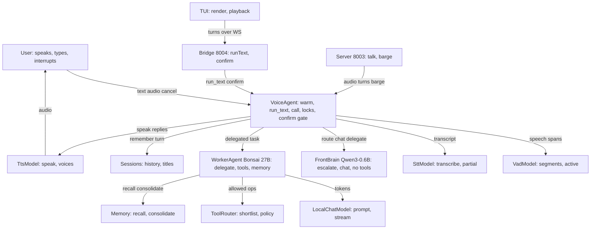
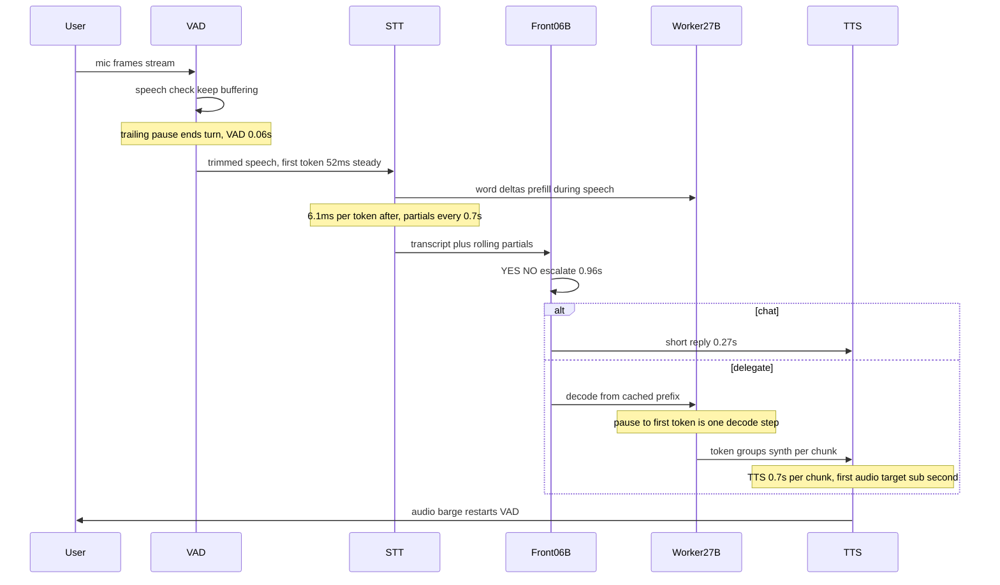

# ARCHITECTURE — entities and how they work

Start here. The part files below it (`architecture/01–08`) hold the
file-and-line detail; this page is the map: every entity, what it owns,
and how a voice turn flows through them.

> The Mermaid blocks below render on GitHub but not in Zed's preview,
> so each one is followed by a plain-ASCII twin that renders anywhere.



ASCII twin (same entities, same edges):

```
User ──text/audio/cancel──▶ VoiceAgent ──speech spans──▶ VadModel
   ▲                            │  transcript            (Silero)
   │                            ▼
   │                     ┌──────────────┐
   │                     │ SttModel     │──partials while speaking
   │                     │ (Whisper)    │  (prefill the LLM cache)
   │                     └──────┬───────┘
   │                            │ route?
   │              ┌─────────────┴──────────────┐
   │              ▼                            ▼
   │     FrontBrain (Qwen3-0.6B)      WorkerAgent (Bonsai 27B)
   │     YES/NO + short chat          tools + router + memory
   │     zero tools                   confirm-gated
   │              │                            │
   │              │   ┌────────────────────────┘
   │              ▼   ▼
   │     LocalChatModel (prompt + parse + tokens)
   │                            │
VoiceAgent ◀── remember_turn ───┤
   │                            ▼
   │                     TtsModel (Kokoro, per sentence)
   │                            │ audio (interruptible: barge restarts VAD)
   └────────────────────────────┘

Transports:  TUI ──WS──▶ Bridge (:8004, run_text + confirm)
             mic ──WS──▶ Server (:8003, loop + partials + barge)
Shared:      ToolRouter (allow/deny policy) · Memory (L1/L2/L3) · Sessions
```

One voice turn, in order:



Measured 2026-10-04 on this box (RTX 3050 4GB): VAD 0.06s, STT
TTFT 52ms steady with 6.1ms per token after, front decide 0.96s,
front chat 0.27s, worker LLM 76s via the gemma-4B CPU sidecar,
TTS 0.7s per chunk, end-to-end 78.3s. Streaming prefill (word deltas
prime the decode leg, abort on revision) and barge-in are live in
server.py — except the sidecar HTTP prime, which stays OFF: a prime
costs 2.4s of prompt processing on the single-slot CPU sidecar, longer
than the pause window, and would hold the only slot while the real
turn waits. Revisit when the worker has slots to spare or runs fused.

ASCII twin (same order, same branches):

```
User ──mic frames (stream)──▶ VAD ──speech? keep buffering──▶ VAD
                                                      │
                               pause ends turn · VAD 0.06s
                                                      ▼
                               STT first token 52ms steady
                               6.1ms per token · partials every 0.7s
                               word deltas prefill the worker
                                                      │
                                               ┌───────┴────────┐
                                               ▼                ▼
                                      Front 0.6B          decode from cache
                                      YES/NO 0.96s        at silence: one step
                                               │          to first token
                               chat: short     │
                               reply 0.27s ──┐ │     token groups synth
                                       ▼       ▼     per chunk 0.7s
                                      TTS ◀── first audio target sub second
                                       │
                                       ▼
                               User (audio; interrupt = barge → back to VAD)

Measured 2026-10-04, RTX 3050 4GB. Prefill, cached decode and sub-second
first audio are targets being built; pause to first audio is the number
this design minimizes.
```

## The entities, briefly

| Entity | What it does | Detail |
|---|---|---|
| `User` | speaks, types, hits Ctrl+C | [TUI](architecture/08-tui.md) |
| `VoiceAgent` (`src/main.py`) | owns legs, locks, queue, confirm gate, turn loop | [01](architecture/01-agent.md) |
| `VadModel` (Silero ONNX) | speech spans, live per-chunk test, endpointing | [05](architecture/05-models.md) |
| `SttModel` (Whisper) | full + rolling-partial transcription | [05](architecture/05-models.md) |
| `FrontBrain` (Qwen3-0.6B) | one YES/NO + short chat replies, zero tools | [01](architecture/01-agent.md) |
| `WorkerAgent` (Bonsai 27B) | deep-agent loop: tools, router, memory, subagents | [01](architecture/01-agent.md), [02](architecture/02-tools.md) |
| `LocalChatModel` | prompt assembly, five parse formats, token stream | [05](architecture/05-models.md) |
| `TtsModel` (Kokoro) | per-sentence synth, voice select, overlap play | [05](architecture/05-models.md) |
| `ToolRouter` | semantic op shortlist + deny/confirm/allowlist policy | [02](architecture/02-tools.md) |
| `Memory` | L1 window injection, L2 episodes, L3 facts | [03](architecture/03-memory.md) |
| `Sessions` | per-session history, titles, locks, resume | [04](architecture/04-sessions.md) |
| `Bridge` (:8004) | terminal + autonomous sockets, confirm mailbox | [06](architecture/06-processes.md) |
| `Server` (:8003) | mic loop, partials, prefill, barge-in, latency | [06](architecture/06-processes.md) |
| `TUI` (`voicert`) | panels, palette, mic viz, playback, interrupt | [08](architecture/08-tui.md) |

Rules that cross entities: one GPU process at a time · `PYTHONPATH=.`
always · confirm before mutating tools · sys logs never in the transcript.
